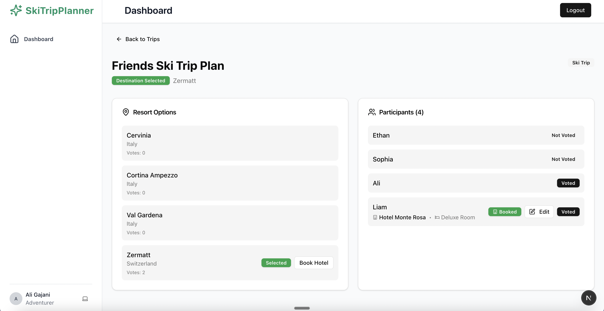
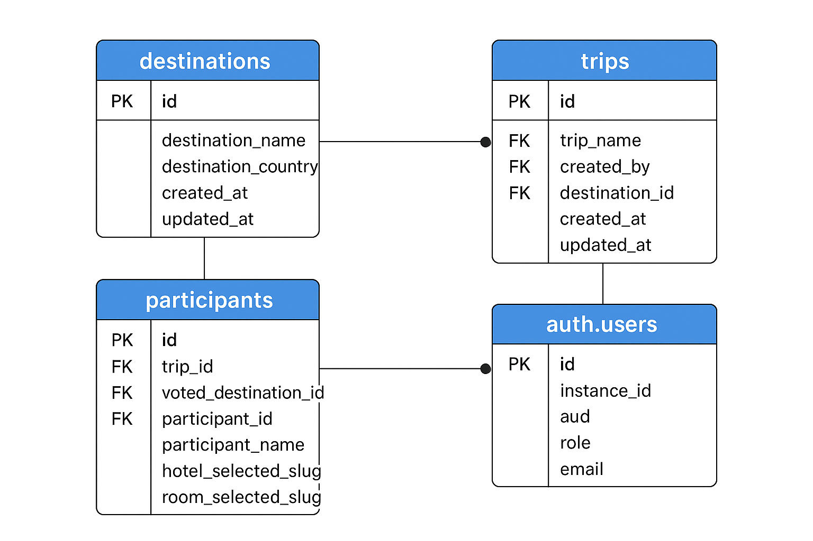

# Ski Trip Planner

A modern web application for planning and organizing ski trips with friends and family.

## Application Screenshot

## AI Tools Used

### Cursor
I've used Cursor as my primary programming assistant throughout the development of this project.

### Specific Tasks Supported

Cursor has been instrumental in supporting the following aspects of development:

- **Planning**: Helped with project architecture and feature planning
- **Coding**: Assisted with writing, refactoring, and optimizing code
- **Debugging**: Provided insights and solutions for technical issues
- **Researching**: Helped with understanding libraries, APIs, and best practices
- **Designing**: Supported UI/UX design decisions and implementation
- **Engineering**: Assisted with system design and technical architecture
- **Prototyping**: Enabled rapid prototyping and iteration
- **Second Brain**: Served as a collaborative thinking partner throughout development

### Reflection on AI Influence

One of the great things about this technology is that you focus more on the product rather than the mechanical aspects of coding. I believe that without such technologies, it would not be possible to deliver a prototype/MVP like this in such a short time (within 24 hours). What it really does is help you think more about the product than getting bogged down into the grunt work.

## Features

- User authentication and authorization
- Trip planning and management
- Hotel booking integration
- Room selection and management
- Participant management
- Resort options and voting system
- Responsive design with modern UI

## If I had more time, I would add the ability to:

1. Create a trip
2. Invite participants to the trip
3. Get notifications of each action
4. Inform everyone about voting and when a consensus is reached
5. Details about the itinerary of the whole trip on a single page.

## Collaboration with non-technical founder

The collaboration with the non-technical founder would involve the use of less jargon, less buzzwords, less technical terms, and more diagrams, more prototyping. Getting to understand the product from a deep level and what are the expectations from all the stakeholders. Once that's done, then there will be a spec document developed to decide what are the high priority deliverables. 

## Database Diagram

## Tech Stack

- Next.js 14
- TypeScript
- Tailwind CSS
- Supabase (Authentication & Database)
- Shadcn/ui components

## Getting Started

1. Clone the repository
2. Install dependencies: `npm install`
3. Set up environment variables (see `env.example`)
4. Run the development server: `npm run dev`

## Project Structure

- `/app` - Next.js app router pages and layouts
- `/components` - Reusable UI components
- `/lib` - Utility functions and services
- `/public` - Static assets